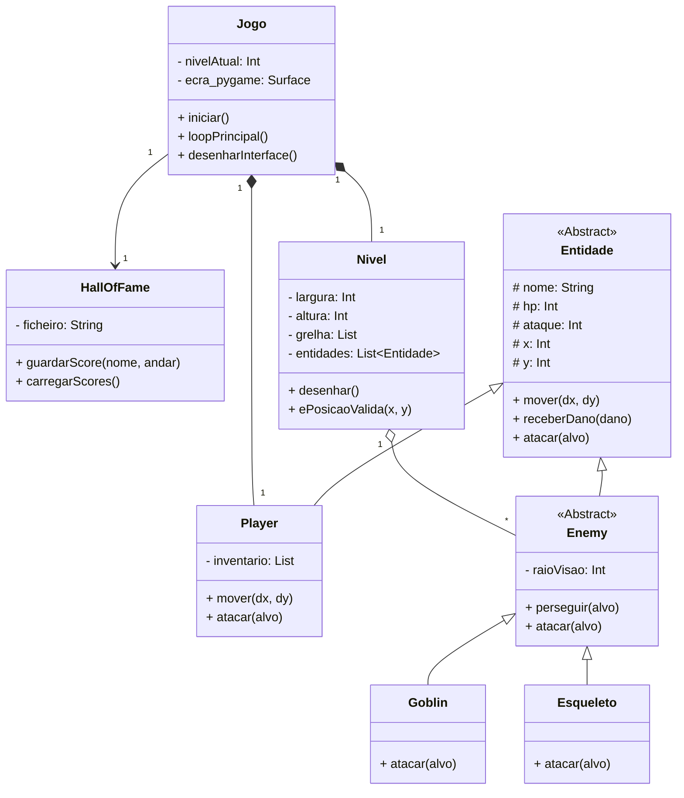

```mermaid
classDiagram
    class Jogo {
        - nivelAtual: Int
        - ecra_pygame: Surface
        + iniciar()
        + loopPrincipal()
        + desenharInterface()
    }
    class HallOfFame {
        - ficheiro: String
        + guardarScore(nome, andar)
        + carregarScores()
    }

    class Nivel {
        - largura: Int
        - altura: Int
        - grelha: List
        - entidades: List~Entidade~
        + desenhar()
        + ePosicaoValida(x, y)
    }

    class Entidade {
        <<Abstract>>
        # nome: String
        # hp: Int
        # ataque: Int
        # x: Int
        # y: Int
        + mover(dx, dy)
        + receberDano(dano)
        + atacar(alvo)
    }

    class Player {
        - inventario: List
        + mover(dx, dy)
        + atacar(alvo)
    }

    class Enemy {
        <<Abstract>>
        - raioVisao: Int
        + perseguir(alvo)
        + atacar(alvo)
    }

    class Goblin {
        + atacar(alvo)
    }

    class Esqueleto {
        + atacar(alvo)
    }

    Jogo "1" *-- "1" Nivel
    Jogo "1" --> "1" HallOfFame
    Jogo "1" *-- "1" Player
    Nivel "1" o-- "*" Enemy
    Entidade <|-- Player
    Entidade <|-- Enemy
    Enemy <|-- Goblin
    Enemy <|-- Esqueleto
```